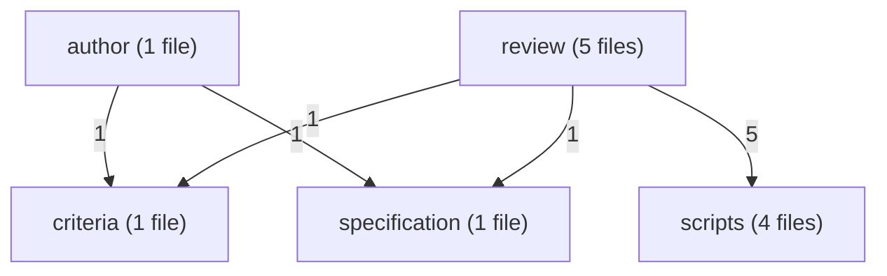
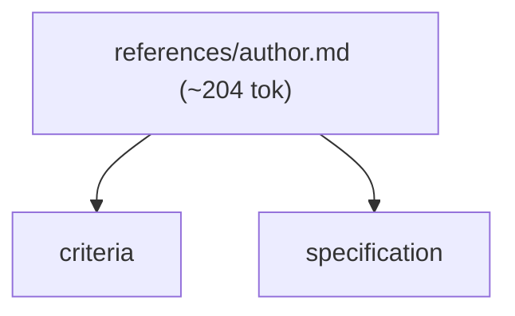
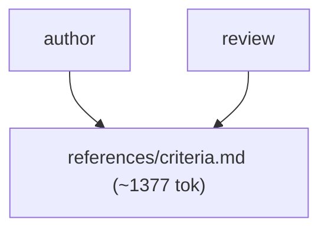
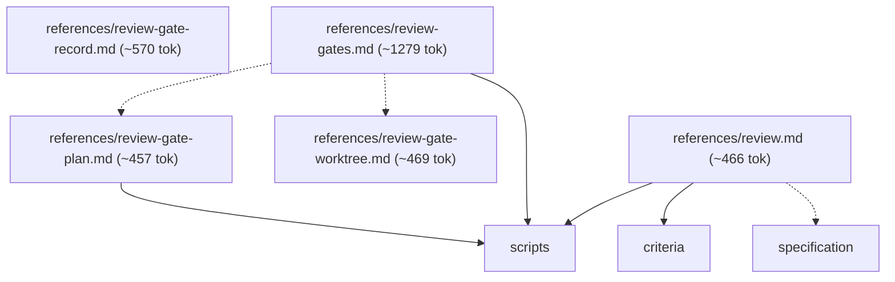
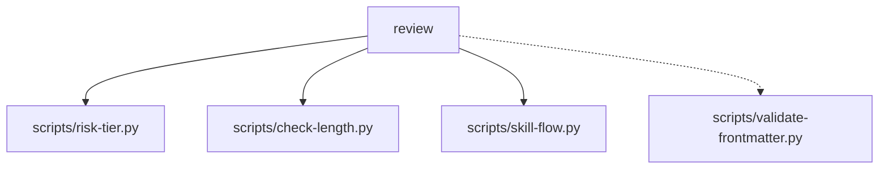
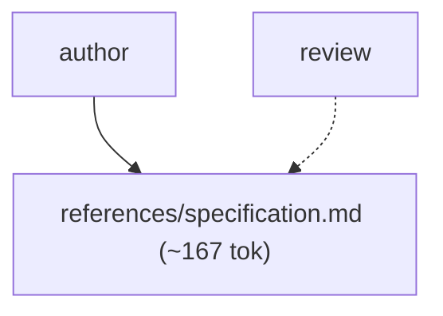

# varde-agent-doc-authoring flow

Generated for human readers; agents do not load this file. Regenerate
with skill-flow.py --write from varde-agent-doc-authoring. Dotted edges
are conditional loads; min tokens follow only solid edges. Thick edges
are hand-offs to a later stage, outside min and max. Double-bordered
nodes are skill modes run inline or agent dispatches. Min and max count
this skill; main adds modes the main agent runs inline, each file once.
Subagents are per dispatch (multiply by the dispatch count); * marks a
conditional dispatch. Module overview first, then one diagram per module.

## Files

- SKILL.md (~235 tok; routes: Author or revise a skill or agent document, Review a skill or agent document, Improve triggering)
  - references/author.md (~204 tok; routes: Author or revise a skill or agent document)
  - references/criteria.md (~1377 tok; routes: Author or revise a skill or agent document, Review a skill or agent document)
  - references/review.md (~466 tok; routes: Review a skill or agent document)
    - references/review-gate-plan.md (~457 tok; routes: Author or revise a skill or agent document, Review a skill or agent document, Improve triggering)
    - references/review-gate-record.md (~570 tok; routes: -)
    - references/review-gate-worktree.md (~469 tok; routes: Author or revise a skill or agent document, Review a skill or agent document, Improve triggering)
    - references/review-gates.md (~1279 tok; routes: Author or revise a skill or agent document, Review a skill or agent document, Improve triggering)
  - references/specification.md (~167 tok; routes: Author or revise a skill or agent document, Review a skill or agent document, Improve triggering)

### author

### criteria

### review

### scripts

### specification

## Routes

| Route | Min tokens | Max tokens | Main min | Main max | Subagents per dispatch | Lookups | Files |
|---|---|---|---|---|---|---|---|
| Author or revise a skill or agent document | ~1983 | ~4188 | ~1983 | ~4188 | review* ~3308, review* ~4596-7371 | 0 | references/author.md, references/review-gates.md, references/criteria.md, references/specification.md, references/review-gate-plan.md, references/review-gate-worktree.md, scripts/risk-tier.py |
| Review a skill or agent document | ~2078 | ~4450 | ~2078 | ~4450 | review* ~3308, review* ~4596-7371 | 0 | references/review.md, references/review-gates.md, references/criteria.md, references/specification.md, scripts/validate-frontmatter.py, scripts/check-length.py, scripts/skill-flow.py, references/review-gate-plan.md, references/review-gate-worktree.md, scripts/risk-tier.py |
| Improve triggering | ~402 | ~2607 | ~402 | ~2607 | review* ~3308, review* ~4596-7371 | 0 | references/specification.md, references/review-gates.md, references/review-gate-plan.md, references/review-gate-worktree.md, scripts/risk-tier.py |

## Structure

| Measure | Value | Target | Status |
|---|---|---|---|
| Mutual links | 0 | 0 | ok |
| Max links out of one file | 5 (references/review.md) | < 6 | ok |
| Average links per linking file | 2.75 (11 links, 4 files) | <= 2 | warning |
| Cross-module edges | 9 | - | - |
| Diagram edges | 21 | <= 60 | ok |
| Max route cyclomatic | 6 | <= 10 | ok |
| Max route cognitive | 11 | <= 10 warn, <= 15 error | warning |
| Most files reached by one route | 10 (Review a skill or agent document) | <= 15 | ok |

- density: average 2.75 links per linking file (target <= 2)

## Findings

- single caller: references/author.md <- SKILL.md: Author or revise a skill or agent document
- single caller: references/review.md <- SKILL.md: Review a skill or agent document
- shared: references/criteria.md <- references/author.md; references/review.md
- shared: references/specification.md <- SKILL.md: Improve triggering; references/author.md; references/review.md
