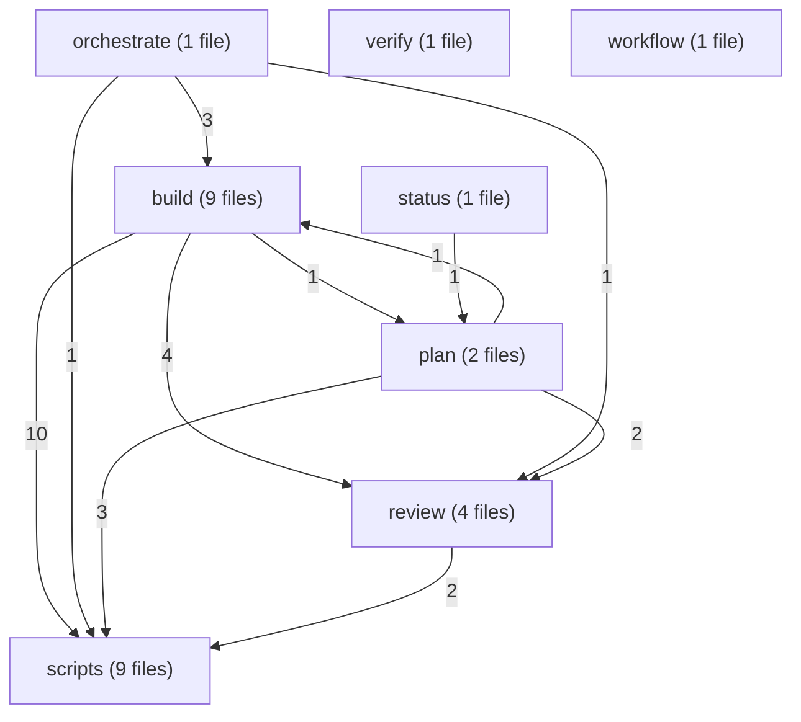
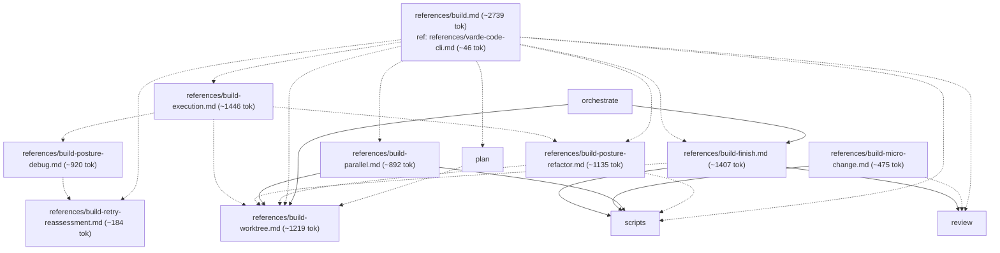
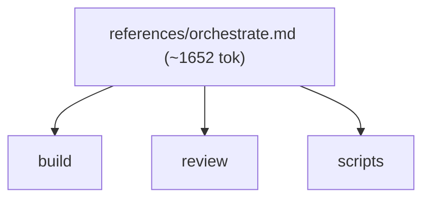
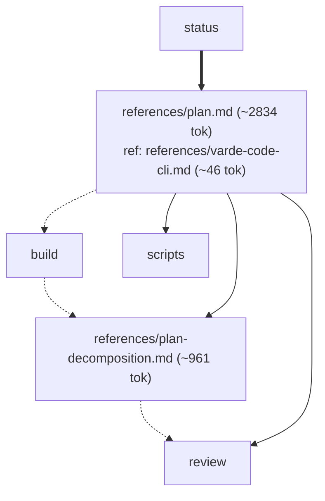
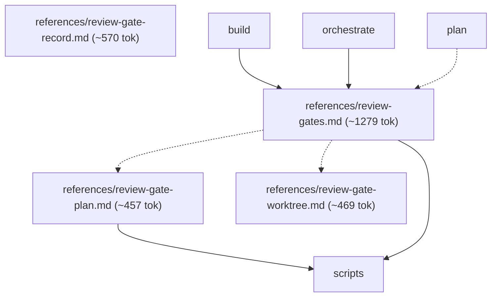
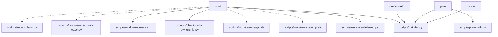
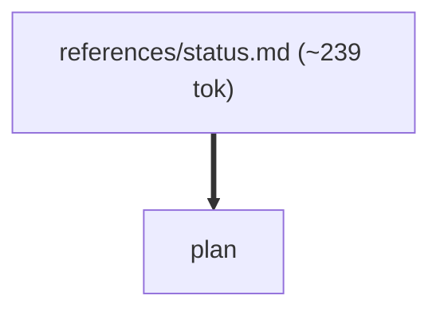
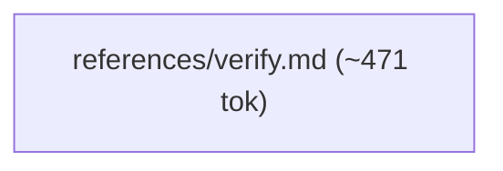
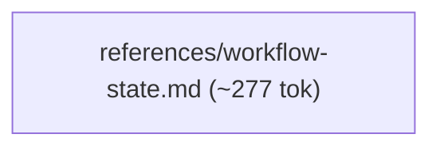

# varde-change flow

Generated for human readers; agents do not load this file. Regenerate
with skill-flow.py --write from varde-agent-doc-authoring. Dotted edges
are conditional loads; min tokens follow only solid edges. Thick edges
are hand-offs to a later stage, outside min and max. Double-bordered
nodes are skill modes run inline or agent dispatches. Min and max count
this skill; main adds modes the main agent runs inline, each file once.
Subagents are per dispatch (multiply by the dispatch count); * marks a
conditional dispatch. Module overview first, then one diagram per module.

## Files

- SKILL.md (~764 tok; routes: "What's in flight?", or an empty invocation — show curren..., Plan a new feature before building, Resume planning with no feature named, One task file assigned by an orchestrator (executor), A settled single-outcome refactor, A settled single-outcome change that fits one task, A named plan, multiple dependent outcomes, unresolved des..., Diagnose why something fails, without fixing it, Fix a named bug or regression, no mode given, Report evidence for finished work without changing anything, Run a group of related plans end to end, in dependency order)
  - references/build.md (~2739 tok; routes: A named plan, multiple dependent outcomes, unresolved des...)
    - references/build-execution.md (~1446 tok; routes: One task file assigned by an orchestrator (executor), A named plan, multiple dependent outcomes, unresolved des...)
    - references/build-finish.md (~1407 tok; routes: A named plan, multiple dependent outcomes, unresolved des..., Run a group of related plans end to end, in dependency order)
    - references/build-micro-change.md (~475 tok; routes: A settled single-outcome refactor, A settled single-outcome change that fits one task)
    - references/build-parallel.md (~892 tok; routes: A named plan, multiple dependent outcomes, unresolved des...)
    - references/build-posture-debug.md (~920 tok; routes: One task file assigned by an orchestrator (executor), A named plan, multiple dependent outcomes, unresolved des..., Diagnose why something fails, without fixing it, Fix a named bug or regression, no mode given)
    - references/build-posture-refactor.md (~1135 tok; routes: One task file assigned by an orchestrator (executor), A settled single-outcome refactor, A named plan, multiple dependent outcomes, unresolved des...)
    - references/build-retry-reassessment.md (~184 tok; routes: One task file assigned by an orchestrator (executor), A named plan, multiple dependent outcomes, unresolved des..., Diagnose why something fails, without fixing it, Fix a named bug or regression, no mode given)
    - references/build-worktree.md (~1219 tok; routes: Plan a new feature before building, Resume planning with no feature named, One task file assigned by an orchestrator (executor), A settled single-outcome refactor, A named plan, multiple dependent outcomes, unresolved des..., Run a group of related plans end to end, in dependency order)
  - references/orchestrate.md (~1652 tok; routes: Run a group of related plans end to end, in dependency order)
  - references/plan.md (~2834 tok; routes: Plan a new feature before building, Resume planning with no feature named)
    - references/plan-decomposition.md (~961 tok; routes: Plan a new feature before building, Resume planning with no feature named, A named plan, multiple dependent outcomes, unresolved des...)
  - references/review-gate-plan.md (~457 tok; routes: "What's in flight?", or an empty invocation — show curren..., Plan a new feature before building, Resume planning with no feature named, A settled single-outcome refactor, A settled single-outcome change that fits one task, A named plan, multiple dependent outcomes, unresolved des..., Diagnose why something fails, without fixing it, Fix a named bug or regression, no mode given, Report evidence for finished work without changing anything, Run a group of related plans end to end, in dependency order)
  - references/review-gate-record.md (~570 tok; routes: -)
  - references/review-gate-worktree.md (~469 tok; routes: "What's in flight?", or an empty invocation — show curren..., Plan a new feature before building, Resume planning with no feature named, A settled single-outcome refactor, A settled single-outcome change that fits one task, A named plan, multiple dependent outcomes, unresolved des..., Diagnose why something fails, without fixing it, Fix a named bug or regression, no mode given, Report evidence for finished work without changing anything, Run a group of related plans end to end, in dependency order)
  - references/review-gates.md (~1279 tok; routes: "What's in flight?", or an empty invocation — show curren..., Plan a new feature before building, Resume planning with no feature named, A settled single-outcome refactor, A settled single-outcome change that fits one task, A named plan, multiple dependent outcomes, unresolved des..., Diagnose why something fails, without fixing it, Fix a named bug or regression, no mode given, Report evidence for finished work without changing anything, Run a group of related plans end to end, in dependency order)
  - references/status.md (~239 tok; routes: "What's in flight?", or an empty invocation — show curren...)
  - references/varde-code-cli.md (~46 tok; routes: Plan a new feature before building, Resume planning with no feature named, A named plan, multiple dependent outcomes, unresolved des...)
  - references/varde-workflow-cli.md (~230 tok; routes: "What's in flight?", or an empty invocation — show curren..., Plan a new feature before building, Resume planning with no feature named, One task file assigned by an orchestrator (executor), A settled single-outcome refactor, A settled single-outcome change that fits one task, A named plan, multiple dependent outcomes, unresolved des..., Diagnose why something fails, without fixing it, Fix a named bug or regression, no mode given, Report evidence for finished work without changing anything, Run a group of related plans end to end, in dependency order)
  - references/verify.md (~471 tok; routes: Report evidence for finished work without changing anything)
  - references/workflow-state.md (~277 tok; routes: "What's in flight?", or an empty invocation — show curren..., Plan a new feature before building, Resume planning with no feature named, One task file assigned by an orchestrator (executor), A settled single-outcome refactor, A settled single-outcome change that fits one task, A named plan, multiple dependent outcomes, unresolved des..., Diagnose why something fails, without fixing it, Fix a named bug or regression, no mode given, Report evidence for finished work without changing anything, Run a group of related plans end to end, in dependency order)

### build

### orchestrate

### plan

### review

### scripts

### status

### verify

### workflow

## Routes

| Route | Min tokens | Max tokens | Main min | Main max | Subagents per dispatch | Lookups | Files |
|---|---|---|---|---|---|---|---|
| "What's in flight?", or an empty invocation — show curren... | ~1003 | ~3715 | ~1003 | ~3715 | review* ~3308, review* ~4596-7371 | 0 | references/status.md, references/review-gates.md, references/varde-workflow-cli.md, references/workflow-state.md, references/review-gate-plan.md, references/review-gate-worktree.md, scripts/risk-tier.py |
| Plan a new feature before building | ~5838 | ~8536 | ~5838 | ~8536 | review ~3308, review ~4596-7371 | 2 | references/plan.md, references/review-gates.md, references/varde-workflow-cli.md, references/workflow-state.md, references/build-worktree.md, scripts/plan-path.py, references/varde-code-cli.md, references/plan-decomposition.md, scripts/risk-tier.py, references/review-gate-plan.md, references/review-gate-worktree.md |
| Resume planning with no feature named | ~5838 | ~8536 | ~5838 | ~8536 | review ~3308, review ~4596-7371 | 2 | references/plan.md, references/review-gates.md, references/varde-workflow-cli.md, references/workflow-state.md, references/build-worktree.md, scripts/plan-path.py, references/varde-code-cli.md, references/plan-decomposition.md, scripts/risk-tier.py, references/review-gate-plan.md, references/review-gate-worktree.md |
| One task file assigned by an orchestrator (executor) | ~2210 | ~6175 | ~2210 | ~6175 | - | 0 | references/build-execution.md, references/varde-workflow-cli.md, references/workflow-state.md, references/build-worktree.md, references/build-posture-debug.md, references/build-posture-refactor.md, references/build-retry-reassessment.md, scripts/worktree-merge.sh, scripts/worktree-cleanup.sh |
| A settled single-outcome refactor | ~2374 | ~6305 | ~2374 | ~6305 | review* ~3308, review* ~4596-7371 | 0 | references/build-micro-change.md, references/build-posture-refactor.md, references/review-gates.md, references/varde-workflow-cli.md, references/workflow-state.md, scripts/risk-tier.py, references/build-worktree.md, scripts/worktree-merge.sh, scripts/worktree-cleanup.sh, references/review-gate-plan.md, references/review-gate-worktree.md |
| A settled single-outcome change that fits one task | ~1239 | ~3951 | ~1239 | ~3951 | review* ~3308, review* ~4596-7371 | 0 | references/build-micro-change.md, references/review-gates.md, references/varde-workflow-cli.md, references/workflow-state.md, scripts/risk-tier.py, references/review-gate-plan.md, references/review-gate-worktree.md |
| A named plan, multiple dependent outcomes, unresolved des... | ~3503 | ~14425 | ~3503 | ~23704 | review* ~3308, review* ~4596-7371, executor* ~5648-7853, executor* ~3539, executor* ~3925-7890 | 1 | references/build.md, references/review-gates.md, references/varde-workflow-cli.md, references/workflow-state.md, references/varde-code-cli.md, references/build-worktree.md, references/plan-decomposition.md, references/build-execution.md, references/build-finish.md, scripts/select-plans.py, scripts/resolve-execution-wave.py, references/build-parallel.md, references/build-posture-refactor.md, references/build-retry-reassessment.md, references/review-gate-plan.md, references/review-gate-worktree.md, scripts/risk-tier.py, references/build-posture-debug.md, scripts/escalate-deferred.py, scripts/worktree-merge.sh, scripts/worktree-cleanup.sh, scripts/worktree-create.sh, scripts/check-task-ownership.py |
| Diagnose why something fails, without fixing it | ~1684 | ~4580 | ~1684 | ~4580 | review* ~3308, review* ~4596-7371 | 0 | references/build-posture-debug.md, references/review-gates.md, references/varde-workflow-cli.md, references/workflow-state.md, references/build-retry-reassessment.md, references/review-gate-plan.md, references/review-gate-worktree.md, scripts/risk-tier.py |
| Fix a named bug or regression, no mode given | ~1684 | ~4580 | ~1684 | ~4580 | review* ~3308, review* ~4596-7371 | 0 | references/build-posture-debug.md, references/review-gates.md, references/varde-workflow-cli.md, references/workflow-state.md, references/build-retry-reassessment.md, references/review-gate-plan.md, references/review-gate-worktree.md, scripts/risk-tier.py |
| Report evidence for finished work without changing anything | ~1235 | ~3947 | ~1235 | ~3947 | review* ~3308, review* ~4596-7371 | 0 | references/verify.md, references/review-gates.md, references/varde-workflow-cli.md, references/workflow-state.md, references/review-gate-plan.md, references/review-gate-worktree.md, scripts/risk-tier.py |
| Run a group of related plans end to end, in dependency order | ~6321 | ~7754 | ~10210 | ~25356 | review ~3308, review ~4596-7371, executor* ~5648-7853, executor* ~3539, executor* ~3925-7890 | 0 | references/orchestrate.md, references/review-gates.md, references/varde-workflow-cli.md, references/workflow-state.md, references/build-worktree.md, scripts/risk-tier.py, references/build-finish.md, references/review-gate-plan.md, references/review-gate-worktree.md, scripts/escalate-deferred.py, scripts/worktree-merge.sh, scripts/worktree-cleanup.sh |

## Structure

| Measure | Value | Target | Status |
|---|---|---|---|
| Mutual links | 0 | 0 | ok |
| Max links out of one file | 11 (references/build.md) | < 6 | warning |
| Average links per linking file | 3.38 (44 links, 13 files) | <= 2 | warning |
| Cross-module edges | 28 | - | - |
| Diagram edges | 87 | <= 60 | warning |
| Max route cyclomatic | 32 | <= 10 | warning |
| Max route cognitive | 79 | <= 10 warn, <= 15 error | defect |
| Most files reached by one route | 23 (A named plan, multiple dependent outcomes, unresolved des...) | <= 15 | warning |

- fan-out: references/build.md (11 links out, target < 6)
- fan-out: references/plan.md (6 links out, target < 6)
- density: average 3.38 links per linking file (target <= 2)

## Findings

- single caller: references/build-parallel.md <- references/build.md
- single caller: references/build.md <- SKILL.md: A named plan, multiple dependent outcomes, unresolved des...
- single caller: references/orchestrate.md <- SKILL.md: Run a group of related plans end to end, in dependency order
- single caller: references/status.md <- SKILL.md: "What's in flight?", or an empty invocation — show curren...
- single caller: references/verify.md <- SKILL.md: Report evidence for finished work without changing anything
- single caller: references/workflow-state.md <- SKILL.md: Gotchas
- shared: references/build-execution.md <- SKILL.md: One task file assigned by an orchestrator (executor); references/build.md
- shared: references/build-finish.md <- references/build.md; references/orchestrate.md
- shared: references/build-micro-change.md <- SKILL.md: A settled single-outcome change that fits one task; SKILL.md: A settled single-outcome refactor
- shared: references/build-posture-debug.md <- SKILL.md: Diagnose why something fails, without fixing it; SKILL.md: Fix a named bug or regression, no mode given; references/build-execution.md
- shared: references/build-posture-refactor.md <- SKILL.md: A settled single-outcome refactor; references/build-execution.md; references/build.md
- shared: references/build-retry-reassessment.md <- references/build-posture-debug.md; references/build.md
- shared: references/build-worktree.md <- references/build-execution.md; references/build-finish.md; references/build-parallel.md; references/build-posture-refactor.md; references/build.md; references/orchestrate.md; references/plan.md
- shared: references/plan-decomposition.md <- references/build.md; references/plan.md
- shared: references/plan.md <- SKILL.md: Plan a new feature before building; SKILL.md: Resume planning with no feature named; references/status.md
