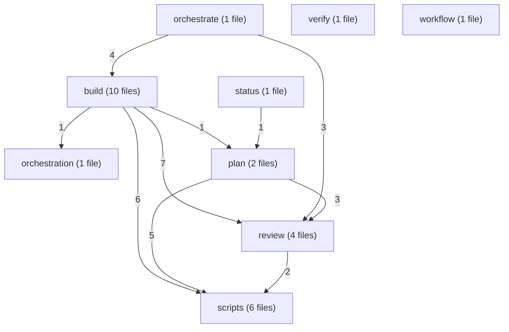
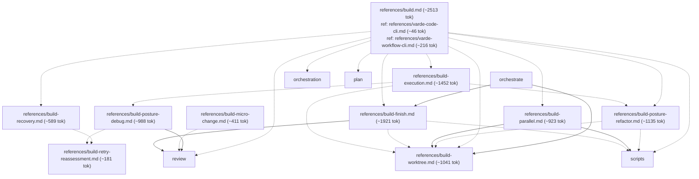
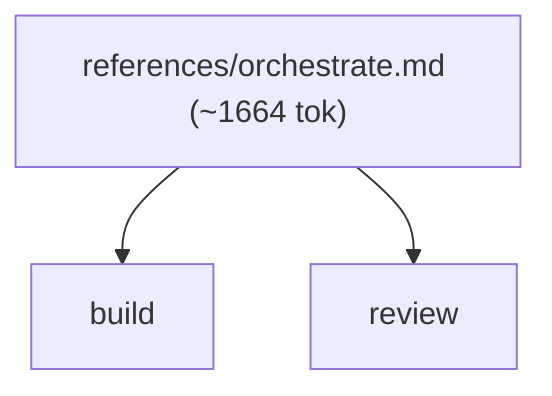
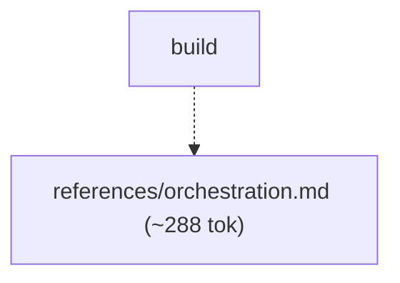
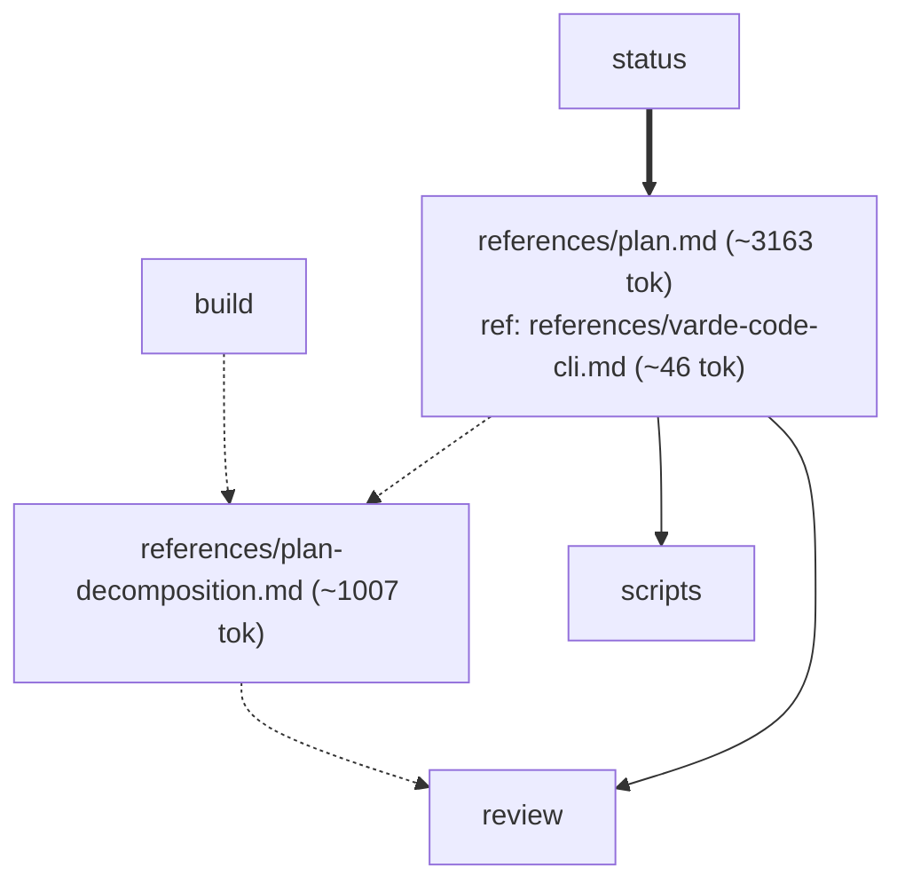
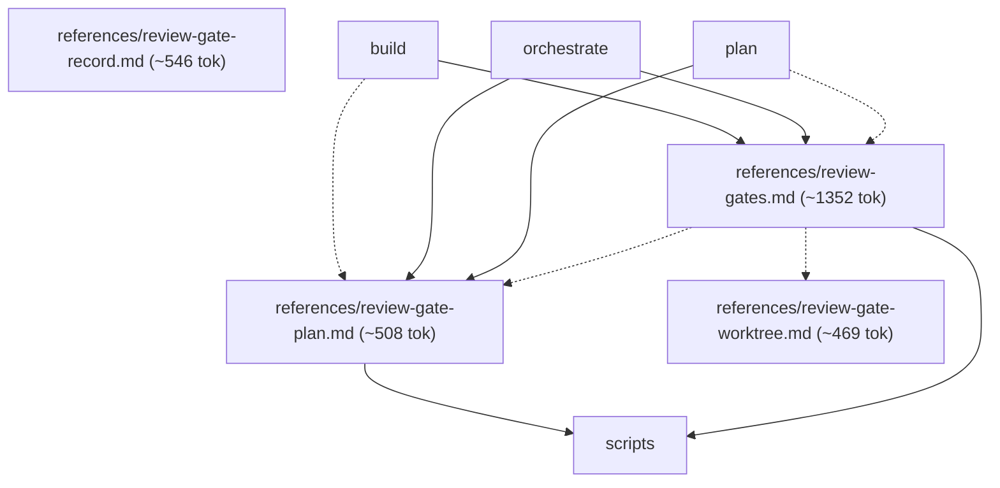
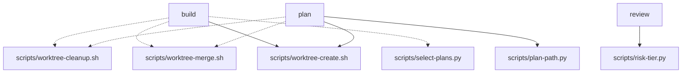
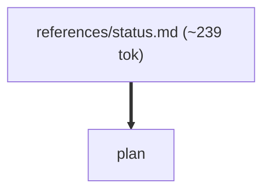
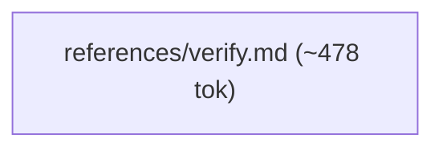
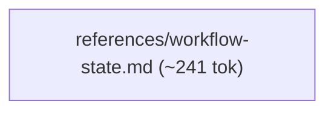

# varde-change flow

Generated for human readers; agents do not load this file. Regenerate
with skill-flow.py --write from varde-agent-doc-authoring. Dotted edges
are conditional loads; min tokens follow only solid edges. Thick edges
are hand-offs to a later stage, outside min and max. Double-bordered
nodes are skill modes run inline or agent dispatches. Min and max count
this skill; main adds modes the main agent runs inline, each file once.
Subagents are per dispatch (multiply by the dispatch count); * marks a
conditional dispatch. Module overview first, then one diagram per module.

## Files

- SKILL.md (~581 tok; routes: "What's in flight?", or an empty invocation — show curren..., Plan a new feature before building, Resume planning with no feature named, One task file assigned by an orchestrator (executor), A settled single-outcome refactor, A settled single-outcome change that fits one task, A named plan, multiple dependent outcomes, unresolved des..., Diagnose why something fails, without fixing it, Fix a named bug or regression, no mode given, Report evidence for finished work without changing anything, Run a group of related plans end to end, in dependency order)
  - references/build.md (~2513 tok; routes: A named plan, multiple dependent outcomes, unresolved des...)
    - references/build-execution.md (~1452 tok; routes: One task file assigned by an orchestrator (executor), A named plan, multiple dependent outcomes, unresolved des...)
    - references/build-finish.md (~1921 tok; routes: A named plan, multiple dependent outcomes, unresolved des..., Run a group of related plans end to end, in dependency order)
    - references/build-micro-change.md (~411 tok; routes: A settled single-outcome refactor, A settled single-outcome change that fits one task)
    - references/build-parallel.md (~923 tok; routes: A named plan, multiple dependent outcomes, unresolved des...)
    - references/build-posture-debug.md (~988 tok; routes: One task file assigned by an orchestrator (executor), A named plan, multiple dependent outcomes, unresolved des..., Diagnose why something fails, without fixing it, Fix a named bug or regression, no mode given)
    - references/build-posture-refactor.md (~1135 tok; routes: One task file assigned by an orchestrator (executor), A settled single-outcome refactor, A named plan, multiple dependent outcomes, unresolved des...)
    - references/build-recovery.md (~589 tok; routes: A named plan, multiple dependent outcomes, unresolved des...)
    - references/build-retry-reassessment.md (~181 tok; routes: One task file assigned by an orchestrator (executor), A named plan, multiple dependent outcomes, unresolved des..., Diagnose why something fails, without fixing it, Fix a named bug or regression, no mode given)
    - references/build-worktree.md (~1041 tok; routes: One task file assigned by an orchestrator (executor), A settled single-outcome refactor, A named plan, multiple dependent outcomes, unresolved des..., Run a group of related plans end to end, in dependency order)
  - references/orchestrate.md (~1664 tok; routes: Run a group of related plans end to end, in dependency order)
  - references/orchestration.md (~288 tok; routes: A named plan, multiple dependent outcomes, unresolved des...)
  - references/plan.md (~3163 tok; routes: Plan a new feature before building, Resume planning with no feature named)
    - references/plan-decomposition.md (~1007 tok; routes: Plan a new feature before building, Resume planning with no feature named, A named plan, multiple dependent outcomes, unresolved des...)
  - references/review-gate-plan.md (~508 tok; routes: "What's in flight?", or an empty invocation — show curren..., Plan a new feature before building, Resume planning with no feature named, A settled single-outcome refactor, A settled single-outcome change that fits one task, A named plan, multiple dependent outcomes, unresolved des..., Diagnose why something fails, without fixing it, Fix a named bug or regression, no mode given, Report evidence for finished work without changing anything, Run a group of related plans end to end, in dependency order)
  - references/review-gate-record.md (~546 tok; routes: -)
  - references/review-gate-worktree.md (~469 tok; routes: "What's in flight?", or an empty invocation — show curren..., Plan a new feature before building, Resume planning with no feature named, A settled single-outcome refactor, A settled single-outcome change that fits one task, A named plan, multiple dependent outcomes, unresolved des..., Diagnose why something fails, without fixing it, Fix a named bug or regression, no mode given, Report evidence for finished work without changing anything, Run a group of related plans end to end, in dependency order)
  - references/review-gates.md (~1352 tok; routes: "What's in flight?", or an empty invocation — show curren..., Plan a new feature before building, Resume planning with no feature named, A settled single-outcome refactor, A settled single-outcome change that fits one task, A named plan, multiple dependent outcomes, unresolved des..., Diagnose why something fails, without fixing it, Fix a named bug or regression, no mode given, Report evidence for finished work without changing anything, Run a group of related plans end to end, in dependency order)
  - references/status.md (~239 tok; routes: "What's in flight?", or an empty invocation — show curren...)
  - references/varde-code-cli.md (~46 tok; routes: Plan a new feature before building, Resume planning with no feature named, A named plan, multiple dependent outcomes, unresolved des...)
  - references/varde-workflow-cli.md (~216 tok; routes: "What's in flight?", or an empty invocation — show curren..., Plan a new feature before building, Resume planning with no feature named, One task file assigned by an orchestrator (executor), A settled single-outcome refactor, A settled single-outcome change that fits one task, A named plan, multiple dependent outcomes, unresolved des..., Diagnose why something fails, without fixing it, Fix a named bug or regression, no mode given, Report evidence for finished work without changing anything, Run a group of related plans end to end, in dependency order)
  - references/verify.md (~478 tok; routes: Report evidence for finished work without changing anything)
  - references/workflow-state.md (~241 tok; routes: "What's in flight?", or an empty invocation — show curren..., Plan a new feature before building, Resume planning with no feature named, One task file assigned by an orchestrator (executor), A settled single-outcome refactor, A settled single-outcome change that fits one task, A named plan, multiple dependent outcomes, unresolved des..., Diagnose why something fails, without fixing it, Fix a named bug or regression, no mode given, Report evidence for finished work without changing anything, Run a group of related plans end to end, in dependency order)

### build

### orchestrate

### orchestration

### plan

### review

### scripts

### status

### verify

### workflow

## Routes

| Route | Min tokens | Max tokens | Main min | Main max | Subagents per dispatch | Lookups | Files |
|---|---|---|---|---|---|---|---|
| "What's in flight?", or an empty invocation — show curren... | ~820 | ~3606 | ~820 | ~3606 | review* ~3406, review* ~4749-7624 | 0 | references/status.md, references/review-gates.md, references/varde-workflow-cli.md, references/workflow-state.md, references/review-gate-plan.md, references/review-gate-worktree.md, scripts/risk-tier.py |
| Plan a new feature before building | ~5604 | ~7583 | ~5604 | ~7583 | review ~3406, review ~4749-7624 | 2 | references/plan.md, references/review-gates.md, references/varde-workflow-cli.md, references/workflow-state.md, scripts/worktree-create.sh, scripts/worktree-merge.sh, scripts/worktree-cleanup.sh, scripts/plan-path.py, references/varde-code-cli.md, references/plan-decomposition.md, references/review-gate-plan.md, references/review-gate-worktree.md, scripts/risk-tier.py |
| Resume planning with no feature named | ~5604 | ~7583 | ~5604 | ~7583 | review ~3406, review ~4749-7624 | 2 | references/plan.md, references/review-gates.md, references/varde-workflow-cli.md, references/workflow-state.md, scripts/worktree-create.sh, scripts/worktree-merge.sh, scripts/worktree-cleanup.sh, scripts/plan-path.py, references/varde-code-cli.md, references/plan-decomposition.md, references/review-gate-plan.md, references/review-gate-worktree.md, scripts/risk-tier.py |
| One task file assigned by an orchestrator (executor) | ~2033 | ~5835 | ~2033 | ~5835 | - | 0 | references/build-execution.md, references/varde-workflow-cli.md, references/workflow-state.md, references/build-worktree.md, references/build-posture-debug.md, references/build-posture-refactor.md, references/build-retry-reassessment.md, scripts/worktree-merge.sh, scripts/worktree-cleanup.sh |
| A settled single-outcome refactor | ~3479 | ~5954 | ~3479 | ~5954 | review ~3406, review ~4749-7624 | 0 | references/build-micro-change.md, references/build-posture-refactor.md, references/review-gates.md, references/varde-workflow-cli.md, references/workflow-state.md, references/build-worktree.md, scripts/worktree-merge.sh, scripts/worktree-cleanup.sh, references/review-gate-plan.md, references/review-gate-worktree.md, scripts/risk-tier.py |
| A settled single-outcome change that fits one task | ~2344 | ~3778 | ~2344 | ~3778 | review ~3406, review ~4749-7624 | 0 | references/build-micro-change.md, references/review-gates.md, references/varde-workflow-cli.md, references/workflow-state.md, references/review-gate-plan.md, references/review-gate-worktree.md, scripts/risk-tier.py |
| A named plan, multiple dependent outcomes, unresolved des... | ~3094 | ~15451 | ~3094 | ~26983 | review* ~3406, review* ~4749-7624, executor* ~6035-8364, executor* ~3573, executor ~3823-7625 | 2 | references/build.md, references/review-gates.md, references/varde-workflow-cli.md, references/workflow-state.md, references/review-gate-plan.md, references/varde-code-cli.md, references/build-worktree.md, references/plan-decomposition.md, references/build-execution.md, references/build-recovery.md, references/build-finish.md, scripts/select-plans.py, references/orchestration.md, references/build-parallel.md, references/build-posture-refactor.md, references/review-gate-worktree.md, scripts/risk-tier.py, references/build-posture-debug.md, references/build-retry-reassessment.md, scripts/worktree-merge.sh, scripts/worktree-cleanup.sh, scripts/worktree-create.sh |
| Diagnose why something fails, without fixing it | ~2921 | ~4536 | ~2921 | ~4536 | review ~3406, review ~4749-7624 | 0 | references/build-posture-debug.md, references/review-gates.md, references/varde-workflow-cli.md, references/workflow-state.md, references/build-retry-reassessment.md, references/review-gate-plan.md, references/review-gate-worktree.md, scripts/risk-tier.py |
| Fix a named bug or regression, no mode given | ~2921 | ~4536 | ~2921 | ~4536 | review ~3406, review ~4749-7624 | 0 | references/build-posture-debug.md, references/review-gates.md, references/varde-workflow-cli.md, references/workflow-state.md, references/build-retry-reassessment.md, references/review-gate-plan.md, references/review-gate-worktree.md, scripts/risk-tier.py |
| Report evidence for finished work without changing anything | ~1059 | ~3845 | ~1059 | ~3845 | review* ~3406, review* ~4749-7624 | 0 | references/verify.md, references/review-gates.md, references/varde-workflow-cli.md, references/workflow-state.md, references/review-gate-plan.md, references/review-gate-worktree.md, scripts/risk-tier.py |
| Run a group of related plans end to end, in dependency order | ~7067 | ~7993 | ~10826 | ~26983 | review ~3406, review ~4749-7624, executor* ~6035-8364, executor* ~3573, executor ~3823-7625 | 0 | references/orchestrate.md, references/review-gates.md, references/varde-workflow-cli.md, references/workflow-state.md, references/build-worktree.md, references/review-gate-plan.md, references/build-finish.md, references/review-gate-worktree.md, scripts/risk-tier.py, scripts/worktree-merge.sh, scripts/worktree-cleanup.sh |

## Structure

| Measure | Value | Target | Status |
|---|---|---|---|
| Mutual links | 0 | 0 | ok |
| Max links out of one file | 13 (references/build.md) | < 6 | warning |
| Average links per linking file | 3.36 (47 links, 14 files) | <= 2 | warning |
| Cross-module edges | 30 | - | - |
| Diagram edges | 95 | <= 60 | warning |
| Max route cyclomatic | 37 | <= 10 | warning |
| Max route cognitive | 92 | <= 10 warn, <= 15 error | defect |
| Most files reached by one route | 22 (A named plan, multiple dependent outcomes, unresolved des...) | <= 15 | warning |

- fan-out: references/build.md (13 links out, target < 6)
- fan-out: references/plan.md (8 links out, target < 6)
- density: average 3.36 links per linking file (target <= 2)

## Findings

- single caller: references/build-parallel.md <- references/build.md
- single caller: references/build-recovery.md <- references/build.md
- single caller: references/build.md <- SKILL.md: A named plan, multiple dependent outcomes, unresolved des...
- single caller: references/orchestrate.md <- SKILL.md: Run a group of related plans end to end, in dependency order
- single caller: references/orchestration.md <- references/build.md
- single caller: references/status.md <- SKILL.md: "What's in flight?", or an empty invocation — show curren...
- single caller: references/verify.md <- SKILL.md: Report evidence for finished work without changing anything
- single caller: references/workflow-state.md <- SKILL.md: Gotchas
- shared: references/build-execution.md <- SKILL.md: One task file assigned by an orchestrator (executor); references/build.md
- shared: references/build-finish.md <- references/build.md; references/orchestrate.md
- shared: references/build-micro-change.md <- SKILL.md: A settled single-outcome change that fits one task; SKILL.md: A settled single-outcome refactor
- shared: references/build-posture-debug.md <- SKILL.md: Diagnose why something fails, without fixing it; SKILL.md: Fix a named bug or regression, no mode given; references/build-execution.md
- shared: references/build-posture-refactor.md <- SKILL.md: A settled single-outcome refactor; references/build-execution.md; references/build.md
- shared: references/build-retry-reassessment.md <- references/build-posture-debug.md; references/build-recovery.md
- shared: references/build-worktree.md <- references/build-execution.md; references/build-finish.md; references/build-parallel.md; references/build-posture-refactor.md; references/build.md; references/orchestrate.md
- shared: references/plan-decomposition.md <- references/build.md; references/plan.md
- shared: references/plan.md <- SKILL.md: Plan a new feature before building; SKILL.md: Resume planning with no feature named; references/status.md
