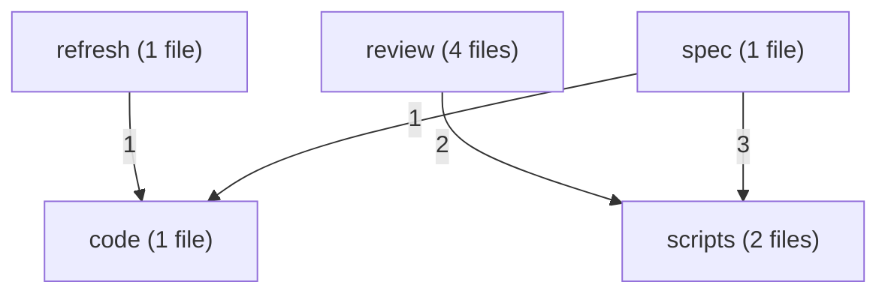
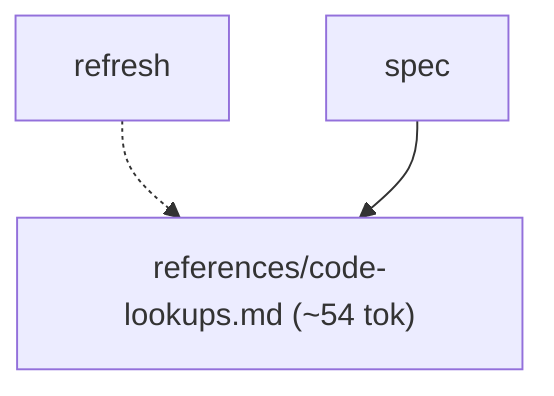
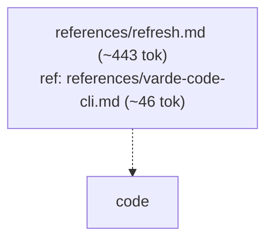
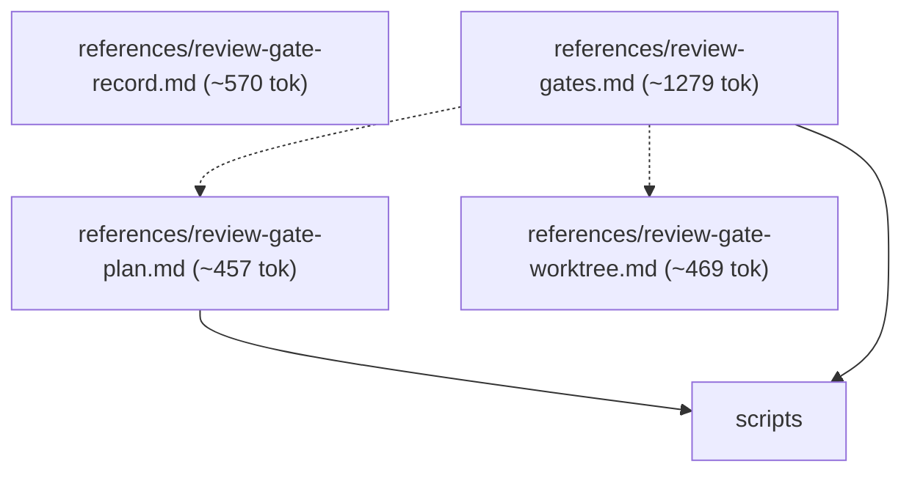
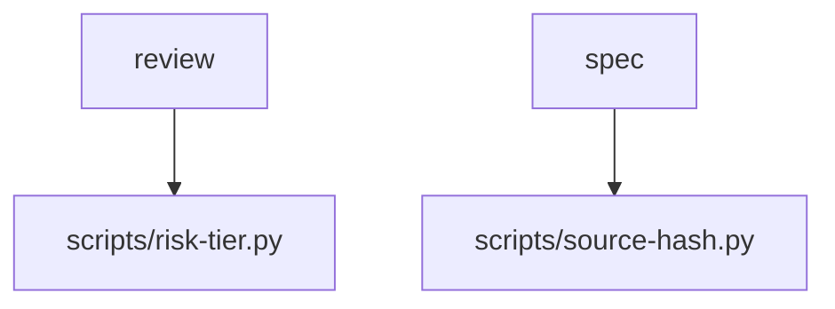
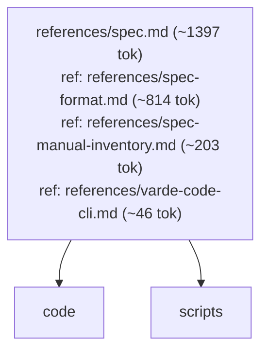

# varde-docs flow

Generated for human readers; agents do not load this file. Regenerate
with skill-flow.py --write from varde-agent-doc-authoring. Dotted edges
are conditional loads; min tokens follow only solid edges. Thick edges
are hand-offs to a later stage, outside min and max. Double-bordered
nodes are skill modes run inline or agent dispatches. Min and max count
this skill; main adds modes the main agent runs inline, each file once.
Subagents are per dispatch (multiply by the dispatch count); * marks a
conditional dispatch. Module overview first, then one diagram per module.

## Files

- SKILL.md (~199 tok; routes: User-facing: README.md, docs/*.md, CHANGELOGs, release no..., A generated domain specification under <knowledge>/specs/)
  - references/code-lookups.md (~54 tok; routes: User-facing: README.md, docs/*.md, CHANGELOGs, release no..., A generated domain specification under <knowledge>/specs/)
  - references/refresh.md (~443 tok; routes: User-facing: README.md, docs/*.md, CHANGELOGs, release no...)
  - references/review-gate-plan.md (~457 tok; routes: User-facing: README.md, docs/*.md, CHANGELOGs, release no..., A generated domain specification under <knowledge>/specs/)
  - references/review-gate-record.md (~570 tok; routes: -)
  - references/review-gate-worktree.md (~469 tok; routes: User-facing: README.md, docs/*.md, CHANGELOGs, release no..., A generated domain specification under <knowledge>/specs/)
  - references/review-gates.md (~1279 tok; routes: User-facing: README.md, docs/*.md, CHANGELOGs, release no..., A generated domain specification under <knowledge>/specs/)
  - references/spec.md (~1397 tok; routes: A generated domain specification under <knowledge>/specs/)
    - references/spec-format.md (~814 tok; routes: A generated domain specification under <knowledge>/specs/)
    - references/spec-manual-inventory.md (~203 tok; routes: A generated domain specification under <knowledge>/specs/)
  - references/varde-code-cli.md (~46 tok; routes: User-facing: README.md, docs/*.md, CHANGELOGs, release no..., A generated domain specification under <knowledge>/specs/)

### code

### refresh

### review

### scripts

### spec

## Routes

| Route | Min tokens | Max tokens | Main min | Main max | Subagents per dispatch | Lookups | Files |
|---|---|---|---|---|---|---|---|
| User-facing: README.md, docs/*.md, CHANGELOGs, release no... | ~642 | ~2947 | ~642 | ~2947 | review* ~3308, review* ~4596-7371 | 1 | references/refresh.md, references/review-gates.md, references/varde-code-cli.md, references/code-lookups.md, references/review-gate-plan.md, references/review-gate-worktree.md, scripts/risk-tier.py |
| A generated domain specification under <knowledge>/specs/ | ~2510 | ~4918 | ~2510 | ~4918 | executor ~3925-7890, review* ~3308, review* ~4596-7371 | 2 | references/spec.md, references/review-gates.md, references/spec-format.md, references/varde-code-cli.md, references/code-lookups.md, references/spec-manual-inventory.md, references/review-gate-plan.md, references/review-gate-worktree.md, scripts/risk-tier.py, scripts/source-hash.py |

## Structure

| Measure | Value | Target | Status |
|---|---|---|---|
| Mutual links | 0 | 0 | ok |
| Max links out of one file | 4 (references/spec.md) | < 6 | ok |
| Average links per linking file | 2.2 (11 links, 5 files) | <= 2 | warning |
| Cross-module edges | 7 | - | - |
| Diagram edges | 21 | <= 60 | ok |
| Max route cyclomatic | 5 | <= 10 | ok |
| Max route cognitive | 9 | <= 10 warn, <= 15 error | ok |
| Most files reached by one route | 10 (A generated domain specification under <knowledge>/specs/) | <= 15 | ok |

- density: average 2.2 links per linking file (target <= 2)

## Findings

- chain: references/spec-format.md <- references/spec.md
- single caller: references/refresh.md <- SKILL.md: User-facing: README.md, docs/*.md, CHANGELOGs, release no...
- single caller: references/spec-manual-inventory.md <- references/spec.md
- single caller: references/spec.md <- SKILL.md: A generated domain specification under <knowledge>/specs/
- shared: references/code-lookups.md <- references/refresh.md; references/spec.md
