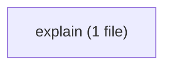
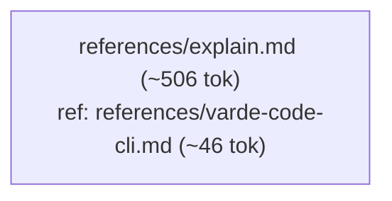

# varde-explore flow

Generated for human readers; agents do not load this file. Regenerate
with skill-flow.py --write from varde-agent-doc-authoring. Dotted edges
are conditional loads; min tokens follow only solid edges. Thick edges
are hand-offs to a later stage, outside min and max. Double-bordered
nodes are skill modes run inline or agent dispatches. Min and max count
this skill; main adds modes the main agent runs inline, each file once.
Subagents are per dispatch (multiply by the dispatch count); * marks a
conditional dispatch. Module overview first, then one diagram per module.

## Files

- SKILL.md (~284 tok; routes: A direct ask to explain a diff or code area, or compare o...)
  - references/explain.md (~506 tok; routes: A direct ask to explain a diff or code area, or compare o...)
  - references/varde-code-cli.md (~46 tok; routes: A direct ask to explain a diff or code area, or compare o...)

### explain

## Routes

| Route | Min tokens | Max tokens | Main min | Main max | Subagents per dispatch | Lookups | Files |
|---|---|---|---|---|---|---|---|
| A direct ask to explain a diff or code area, or compare o... | ~836 | ~836 | ~836 | ~836 | - | 0 | references/explain.md, references/varde-code-cli.md |

## Structure

| Measure | Value | Target | Status |
|---|---|---|---|
| Mutual links | 0 | 0 | ok |
| Max links out of one file | 1 (references/explain.md) | < 6 | ok |
| Average links per linking file | 1.0 (1 links, 1 file) | <= 2 | ok |
| Cross-module edges | 1 | - | - |
| Diagram edges | 3 | <= 60 | ok |
| Max route cyclomatic | 1 | <= 10 | ok |
| Max route cognitive | 0 | <= 10 warn, <= 15 error | ok |
| Most files reached by one route | 2 (A direct ask to explain a diff or code area, or compare o...) | <= 15 | ok |

## Findings

- single caller: references/explain.md <- SKILL.md: A direct ask to explain a diff or code area, or compare o...
