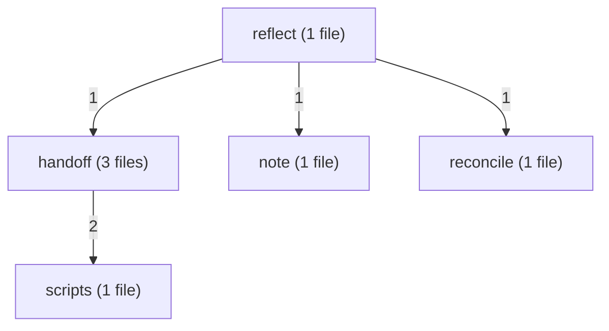
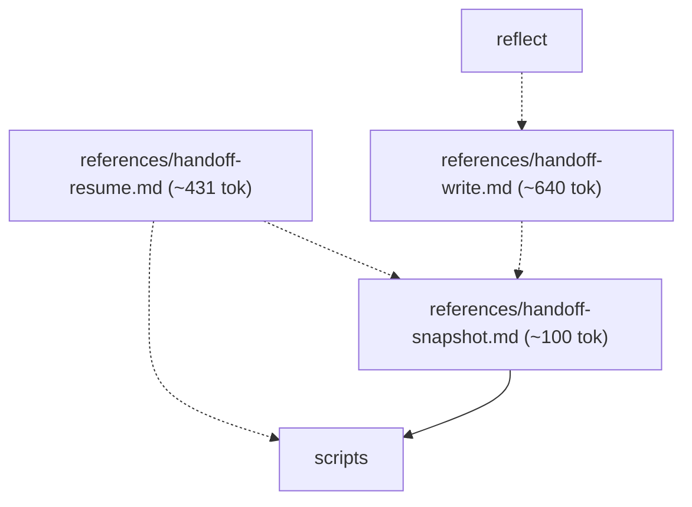
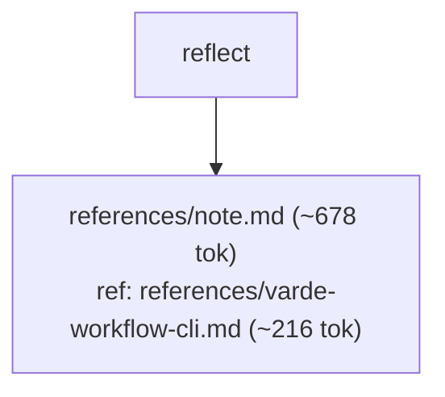
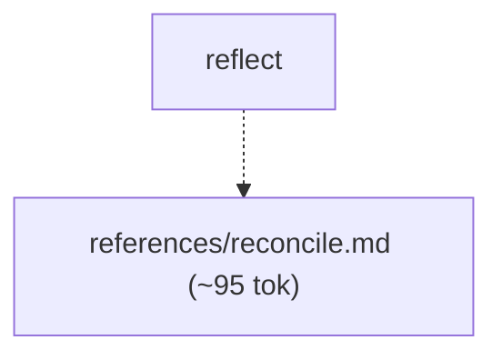
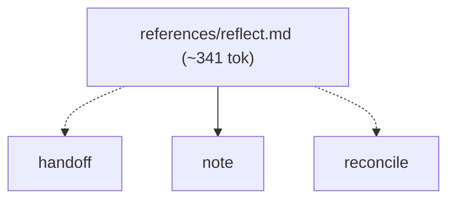
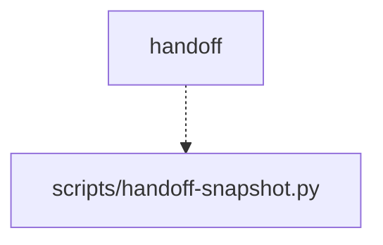

# varde-knowledge flow

Generated for human readers; agents do not load this file. Regenerate
with skill-flow.py --write from varde-agent-doc-authoring. Dotted edges
are conditional loads; min tokens follow only solid edges. Thick edges
are hand-offs to a later stage, outside min and max. Double-bordered
nodes are skill modes run inline or agent dispatches. Min and max count
this skill; main adds modes the main agent runs inline, each file once.
Subagents are per dispatch (multiply by the dispatch count); * marks a
conditional dispatch. Module overview first, then one diagram per module.

## Files

- SKILL.md (~227 tok; routes: Find or record durable knowledge — a decision, pattern, d..., Wrap up finished work or capture what was learned, Write a handoff, Resume a handoff, or pick up where a previous session lef..., Check a knowledge note against current code)
  - references/handoff-resume.md (~431 tok; routes: Resume a handoff, or pick up where a previous session lef...)
  - references/handoff-snapshot.md (~100 tok; routes: Wrap up finished work or capture what was learned, Write a handoff, Resume a handoff, or pick up where a previous session lef...)
  - references/handoff-write.md (~640 tok; routes: Wrap up finished work or capture what was learned, Write a handoff)
  - references/note.md (~678 tok; routes: Find or record durable knowledge — a decision, pattern, d..., Wrap up finished work or capture what was learned)
  - references/reconcile.md (~95 tok; routes: Wrap up finished work or capture what was learned, Check a knowledge note against current code)
  - references/reflect.md (~341 tok; routes: Wrap up finished work or capture what was learned)
  - references/varde-workflow-cli.md (~216 tok; routes: Find or record durable knowledge — a decision, pattern, d..., Wrap up finished work or capture what was learned)

### handoff

### note

### reconcile

### reflect

### scripts

## Routes

| Route | Min tokens | Max tokens | Main min | Main max | Subagents per dispatch | Lookups | Files |
|---|---|---|---|---|---|---|---|
| Find or record durable knowledge — a decision, pattern, d... | ~905 | ~1121 | ~905 | ~1121 | - | 1 | references/note.md, references/varde-workflow-cli.md |
| Wrap up finished work or capture what was learned | ~1246 | ~2297 | ~1246 | ~2297 | - | 1 | references/reflect.md, references/note.md, references/handoff-write.md, references/reconcile.md, references/varde-workflow-cli.md, references/handoff-snapshot.md, scripts/handoff-snapshot.py |
| Write a handoff | ~867 | ~967 | ~867 | ~967 | - | 0 | references/handoff-write.md, references/handoff-snapshot.md, scripts/handoff-snapshot.py |
| Resume a handoff, or pick up where a previous session lef... | ~658 | ~758 | ~658 | ~758 | - | 0 | references/handoff-resume.md, scripts/handoff-snapshot.py, references/handoff-snapshot.md |
| Check a knowledge note against current code | ~322 | ~322 | ~322 | ~322 | - | 0 | references/reconcile.md |

## Structure

| Measure | Value | Target | Status |
|---|---|---|---|
| Mutual links | 0 | 0 | ok |
| Max links out of one file | 3 (references/reflect.md) | < 6 | ok |
| Average links per linking file | 1.6 (8 links, 5 files) | <= 2 | ok |
| Cross-module edges | 6 | - | - |
| Diagram edges | 15 | <= 60 | ok |
| Max route cyclomatic | 5 | <= 10 | ok |
| Max route cognitive | 10 | <= 10 warn, <= 15 error | ok |
| Most files reached by one route | 7 (Wrap up finished work or capture what was learned) | <= 15 | ok |

## Findings

- single caller: references/handoff-resume.md <- SKILL.md: Resume a handoff, or pick up where a previous session lef...
- single caller: references/reflect.md <- SKILL.md: Wrap up finished work or capture what was learned
- shared: references/handoff-snapshot.md <- references/handoff-resume.md; references/handoff-write.md
- shared: references/handoff-write.md <- SKILL.md: Write a handoff; references/reflect.md
- shared: references/note.md <- SKILL.md: Find or record durable knowledge — a decision, pattern, d...; references/reflect.md
- shared: references/reconcile.md <- SKILL.md: Check a knowledge note against current code; references/reflect.md
