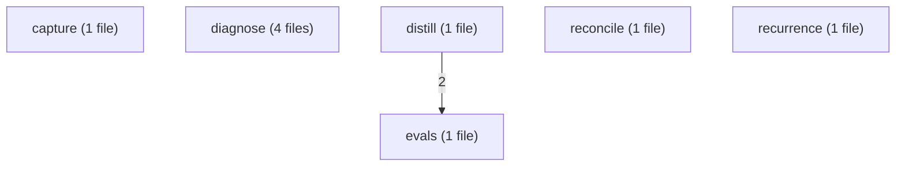
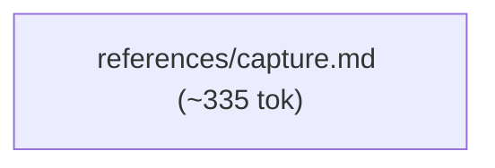
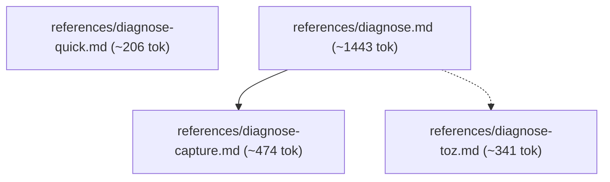
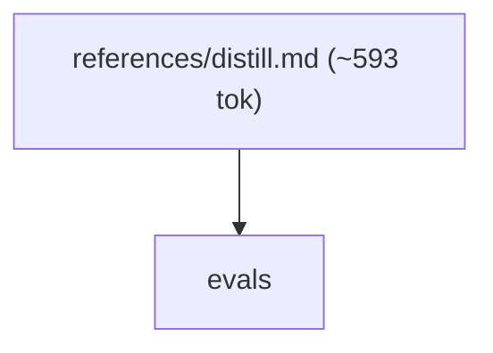
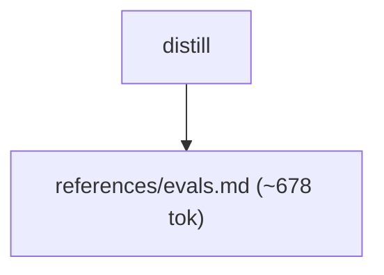
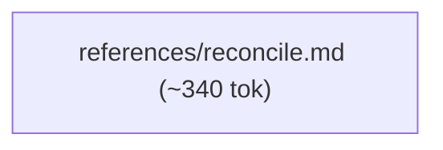
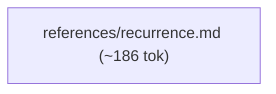

# varde-learn flow

Generated for human readers; agents do not load this file. Regenerate
with skill-flow.py --write from varde-agent-doc-authoring. Dotted edges
are conditional loads; min tokens follow only solid edges. Thick edges
are hand-offs to a later stage, outside min and max. Double-bordered
nodes are skill modes run inline or agent dispatches. Min and max count
this skill; main adds modes the main agent runs inline, each file once.
Subagents are per dispatch (multiply by the dispatch count); * marks a
conditional dispatch. Module overview first, then one diagram per module.

## Files

- SKILL.md (~341 tok; routes: Capture an observed friction event, Triage supplied agent-session evidence without a session-..., Diagnose an existing or current agent session, Reconcile an item against evidence, Distill recurring friction into an improvement, Check whether an adopted change recurred, Author query sets or eval cases, or run an approved evalu...)
  - references/capture.md (~335 tok; routes: Capture an observed friction event)
  - references/diagnose.md (~1443 tok; routes: Diagnose an existing or current agent session)
    - references/diagnose-capture.md (~474 tok; routes: Diagnose an existing or current agent session)
    - references/diagnose-quick.md (~206 tok; routes: Triage supplied agent-session evidence without a session-...)
    - references/diagnose-toz.md (~341 tok; routes: Diagnose an existing or current agent session)
  - references/distill.md (~593 tok; routes: Distill recurring friction into an improvement)
  - references/evals.md (~678 tok; routes: Distill recurring friction into an improvement, Author query sets or eval cases, or run an approved evalu...)
  - references/reconcile.md (~340 tok; routes: Reconcile an item against evidence)
  - references/recurrence.md (~186 tok; routes: Check whether an adopted change recurred)

### capture

### diagnose

### distill

### evals

### reconcile

### recurrence

## Routes

| Route | Min tokens | Max tokens | Main min | Main max | Subagents per dispatch | Lookups | Files |
|---|---|---|---|---|---|---|---|
| Capture an observed friction event | ~676 | ~676 | ~676 | ~676 | - | 0 | references/capture.md |
| Triage supplied agent-session evidence without a session-... | ~547 | ~547 | ~547 | ~547 | - | 0 | references/diagnose-quick.md |
| Diagnose an existing or current agent session | ~2258 | ~2599 | ~2258 | ~2599 | - | 0 | references/diagnose.md, references/diagnose-toz.md, references/diagnose-capture.md |
| Reconcile an item against evidence | ~681 | ~681 | ~681 | ~681 | - | 0 | references/reconcile.md |
| Distill recurring friction into an improvement | ~1612 | ~1612 | ~5264 | ~10348 | review* ~3308, review* ~4596-7371 | 0 | references/distill.md, references/evals.md |
| Check whether an adopted change recurred | ~527 | ~527 | ~527 | ~527 | - | 0 | references/recurrence.md |
| Author query sets or eval cases, or run an approved evalu... | ~1019 | ~1019 | ~1019 | ~1019 | - | 0 | references/evals.md |

## Structure

| Measure | Value | Target | Status |
|---|---|---|---|
| Mutual links | 0 | 0 | ok |
| Max links out of one file | 2 (references/diagnose.md) | < 6 | ok |
| Average links per linking file | 1.5 (3 links, 2 files) | <= 2 | ok |
| Cross-module edges | 1 | - | - |
| Diagram edges | 12 | <= 60 | ok |
| Max route cyclomatic | 2 | <= 10 | ok |
| Max route cognitive | 2 | <= 10 warn, <= 15 error | ok |
| Most files reached by one route | 3 (Diagnose an existing or current agent session) | <= 15 | ok |

## Findings

- chain: references/diagnose-capture.md <- references/diagnose.md
- single caller: references/capture.md <- SKILL.md: Capture an observed friction event
- single caller: references/diagnose-quick.md <- SKILL.md: Triage supplied agent-session evidence without a session-...
- single caller: references/diagnose-toz.md <- references/diagnose.md
- single caller: references/diagnose.md <- SKILL.md: Diagnose an existing or current agent session
- single caller: references/distill.md <- SKILL.md: Distill recurring friction into an improvement
- single caller: references/reconcile.md <- SKILL.md: Reconcile an item against evidence
- single caller: references/recurrence.md <- SKILL.md: Check whether an adopted change recurred
- shared: references/evals.md <- SKILL.md: Author query sets or eval cases, or run an approved evalu...; references/distill.md
