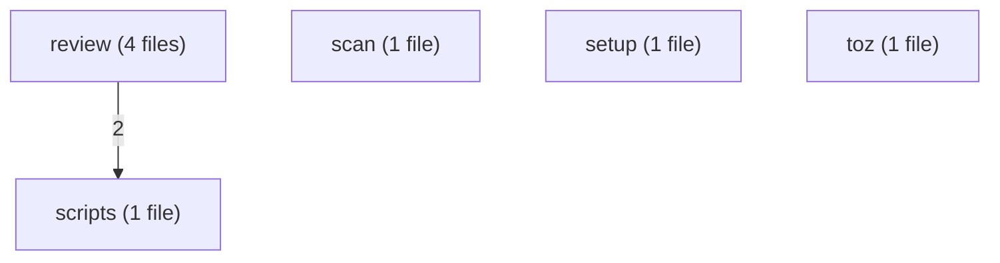
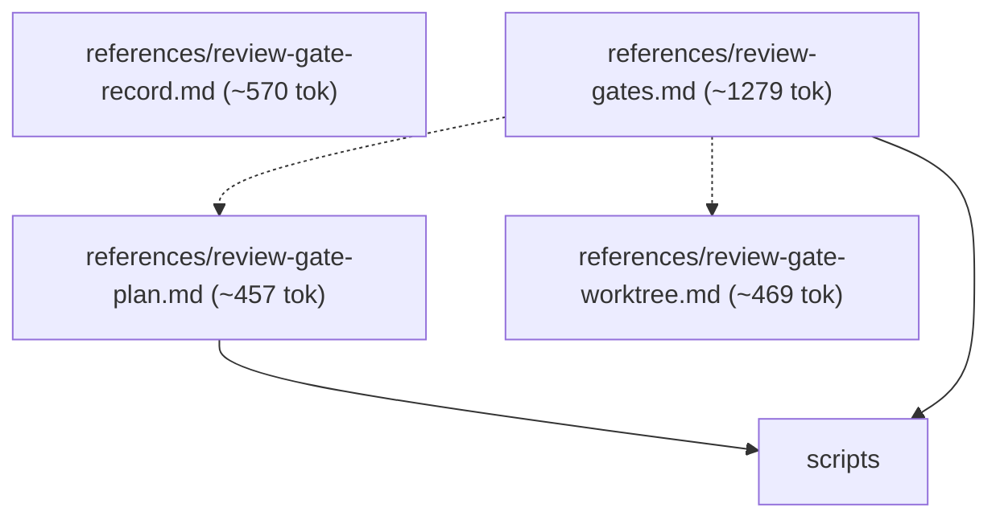
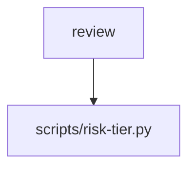
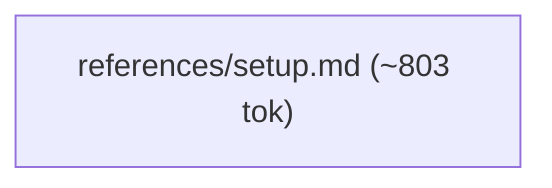

# varde-manage flow

Generated for human readers; agents do not load this file. Regenerate
with skill-flow.py --write from varde-agent-doc-authoring. Dotted edges
are conditional loads; min tokens follow only solid edges. Thick edges
are hand-offs to a later stage, outside min and max. Double-bordered
nodes are skill modes run inline or agent dispatches. Min and max count
this skill; main adds modes the main agent runs inline, each file once.
Subagents are per dispatch (multiply by the dispatch count); * marks a
conditional dispatch. Module overview first, then one diagram per module.

## Files

- SKILL.md (~404 tok; routes: Install, update, repair wiring, or configure paths and ca..., Add a code scan rule or tune its matches, severity, or th..., Customize tool-output previews, sections, or extracted re...)
  - references/review-gate-plan.md (~457 tok; routes: Install, update, repair wiring, or configure paths and ca..., Add a code scan rule or tune its matches, severity, or th..., Customize tool-output previews, sections, or extracted re...)
  - references/review-gate-record.md (~570 tok; routes: -)
  - references/review-gate-worktree.md (~469 tok; routes: Install, update, repair wiring, or configure paths and ca..., Add a code scan rule or tune its matches, severity, or th..., Customize tool-output previews, sections, or extracted re...)
  - references/review-gates.md (~1279 tok; routes: Install, update, repair wiring, or configure paths and ca..., Add a code scan rule or tune its matches, severity, or th..., Customize tool-output previews, sections, or extracted re...)
  - references/scan-author.md (~1914 tok; routes: Add a code scan rule or tune its matches, severity, or th...)
  - references/setup.md (~803 tok; routes: Install, update, repair wiring, or configure paths and ca...)
  - references/toz-profiles.md (~925 tok; routes: Customize tool-output previews, sections, or extracted re...)

### review

### scan

### scripts

### setup

### toz

## Routes

| Route | Min tokens | Max tokens | Main min | Main max | Subagents per dispatch | Lookups | Files |
|---|---|---|---|---|---|---|---|
| Install, update, repair wiring, or configure paths and ca... | ~1207 | ~3412 | ~1207 | ~3412 | review* ~3308, review* ~4596-7371 | 0 | references/setup.md, references/review-gates.md, references/review-gate-plan.md, references/review-gate-worktree.md, scripts/risk-tier.py |
| Add a code scan rule or tune its matches, severity, or th... | ~2318 | ~4523 | ~2318 | ~4523 | review* ~3308, review* ~4596-7371 | 0 | references/scan-author.md, references/review-gates.md, references/review-gate-plan.md, references/review-gate-worktree.md, scripts/risk-tier.py |
| Customize tool-output previews, sections, or extracted re... | ~1329 | ~3534 | ~1329 | ~3534 | review* ~3308, review* ~4596-7371 | 0 | references/toz-profiles.md, references/review-gates.md, references/review-gate-plan.md, references/review-gate-worktree.md, scripts/risk-tier.py |

## Structure

| Measure | Value | Target | Status |
|---|---|---|---|
| Mutual links | 0 | 0 | ok |
| Max links out of one file | 3 (references/review-gates.md) | < 6 | ok |
| Average links per linking file | 2.0 (4 links, 2 files) | <= 2 | ok |
| Cross-module edges | 2 | - | - |
| Diagram edges | 13 | <= 60 | ok |
| Max route cyclomatic | 4 | <= 10 | ok |
| Max route cognitive | 7 | <= 10 warn, <= 15 error | ok |
| Most files reached by one route | 5 (Install, update, repair wiring, or configure paths and ca...) | <= 15 | ok |

## Findings

- single caller: references/scan-author.md <- SKILL.md: Add a code scan rule or tune its matches, severity, or th...
- single caller: references/setup.md <- SKILL.md: Install, update, repair wiring, or configure paths and ca...
- single caller: references/toz-profiles.md <- SKILL.md: Customize tool-output previews, sections, or extracted re...
