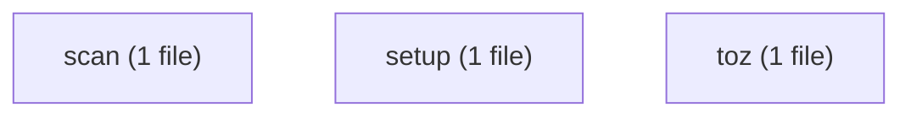
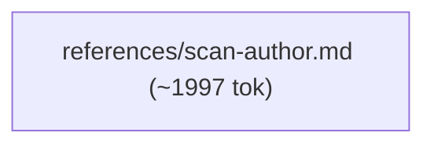
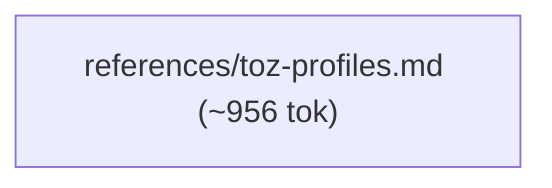

# varde-manage flow

Generated for human readers; agents do not load this file. Regenerate
with skill-flow.py --write from varde-agent-doc-authoring. Dotted edges
are conditional loads; min tokens follow only solid edges. Thick edges
are hand-offs to a later stage, outside min and max. Double-bordered
nodes are skill modes run inline or agent dispatches. Min and max count
this skill; main adds modes the main agent runs inline, each file once.
Subagents are per dispatch (multiply by the dispatch count); * marks a
conditional dispatch. Module overview first, then one diagram per module.

## Files

- SKILL.md (~356 tok; routes: Install, update, repair wiring, or configure paths and ca..., Add a code scan rule or tune its matches, severity, or th..., Customize tool-output previews, sections, or extracted re...)
  - references/scan-author.md (~1997 tok; routes: Add a code scan rule or tune its matches, severity, or th...)
  - references/setup.md (~990 tok; routes: Install, update, repair wiring, or configure paths and ca...)
  - references/toz-profiles.md (~956 tok; routes: Customize tool-output previews, sections, or extracted re...)

### scan

### setup

### toz

## Routes

| Route | Min tokens | Max tokens | Main min | Main max | Subagents per dispatch | Lookups | Files |
|---|---|---|---|---|---|---|---|
| Install, update, repair wiring, or configure paths and ca... | ~1346 | ~1346 | ~1346 | ~1346 | - | 0 | references/setup.md |
| Add a code scan rule or tune its matches, severity, or th... | ~2353 | ~2353 | ~2353 | ~2353 | - | 0 | references/scan-author.md |
| Customize tool-output previews, sections, or extracted re... | ~1312 | ~1312 | ~1312 | ~1312 | - | 0 | references/toz-profiles.md |

## Structure

| Measure | Value | Target | Status |
|---|---|---|---|
| Mutual links | 0 | 0 | ok |
| Max links out of one file | 0 | < 6 | ok |
| Average links per linking file | 0 (0 links, 0 files) | <= 2 | ok |
| Cross-module edges | 0 | - | - |
| Diagram edges | 3 | <= 60 | ok |
| Max route cyclomatic | 1 | <= 10 | ok |
| Max route cognitive | 0 | <= 10 warn, <= 15 error | ok |
| Most files reached by one route | 1 (Install, update, repair wiring, or configure paths and ca...) | <= 15 | ok |

## Findings

- single caller: references/scan-author.md <- SKILL.md: Add a code scan rule or tune its matches, severity, or th...
- single caller: references/setup.md <- SKILL.md: Install, update, repair wiring, or configure paths and ca...
- single caller: references/toz-profiles.md <- SKILL.md: Customize tool-output previews, sections, or extracted re...
