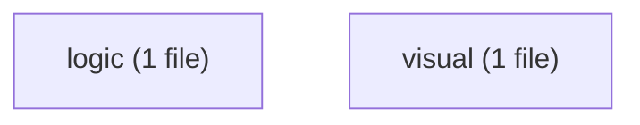
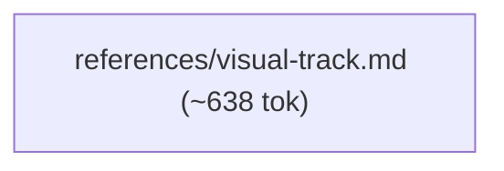

# varde-prototype flow

Generated for human readers; agents do not load this file. Regenerate
with skill-flow.py --write from varde-agent-doc-authoring. Dotted edges
are conditional loads; min tokens follow only solid edges. Thick edges
are hand-offs to a later stage, outside min and max. Double-bordered
nodes are skill modes run inline or agent dispatches. Min and max count
this skill; main adds modes the main agent runs inline, each file once.
Subagents are per dispatch (multiply by the dispatch count); * marks a
conditional dispatch. Module overview first, then one diagram per module.

## Files

- SKILL.md (~474 tok; routes: Shape, prototype, or refine a frontend page, layout, or c..., "Does this state model, logic, or data shape feel right?"...)
  - references/logic-track.md (~402 tok; routes: "Does this state model, logic, or data shape feel right?"...)
  - references/visual-track.md (~638 tok; routes: Shape, prototype, or refine a frontend page, layout, or c...)

### logic

### visual

## Routes

| Route | Min tokens | Max tokens | Main min | Main max | Subagents per dispatch | Lookups | Files |
|---|---|---|---|---|---|---|---|
| Shape, prototype, or refine a frontend page, layout, or c... | ~1112 | ~1112 | ~1112 | ~1112 | - | 0 | references/visual-track.md |
| "Does this state model, logic, or data shape feel right?"... | ~876 | ~876 | ~876 | ~876 | - | 0 | references/logic-track.md |

## Structure

| Measure | Value | Target | Status |
|---|---|---|---|
| Mutual links | 0 | 0 | ok |
| Max links out of one file | 0 | < 6 | ok |
| Average links per linking file | 0 (0 links, 0 files) | <= 2 | ok |
| Cross-module edges | 0 | - | - |
| Diagram edges | 2 | <= 60 | ok |
| Max route cyclomatic | 1 | <= 10 | ok |
| Max route cognitive | 0 | <= 10 warn, <= 15 error | ok |
| Most files reached by one route | 1 (Shape, prototype, or refine a frontend page, layout, or c...) | <= 15 | ok |

## Findings

- single caller: references/logic-track.md <- SKILL.md: "Does this state model, logic, or data shape feel right?"...
- single caller: references/visual-track.md <- SKILL.md: Shape, prototype, or refine a frontend page, layout, or c...
