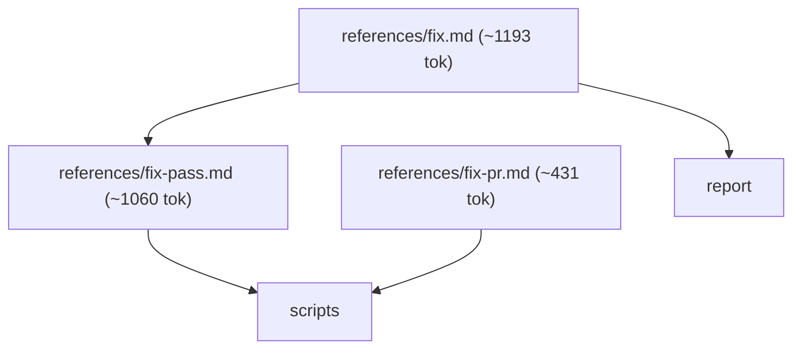
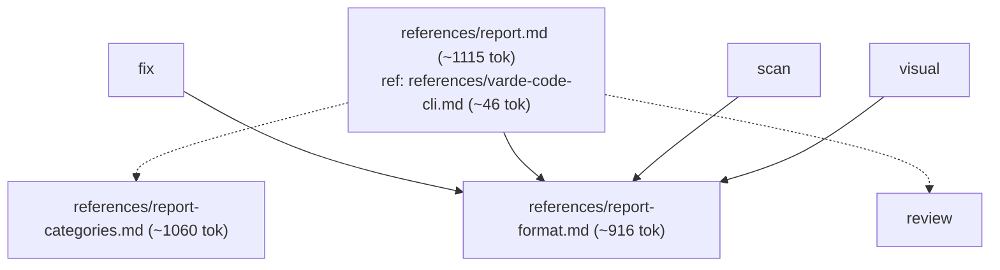
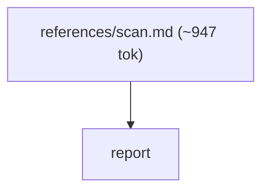
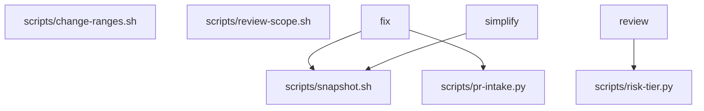
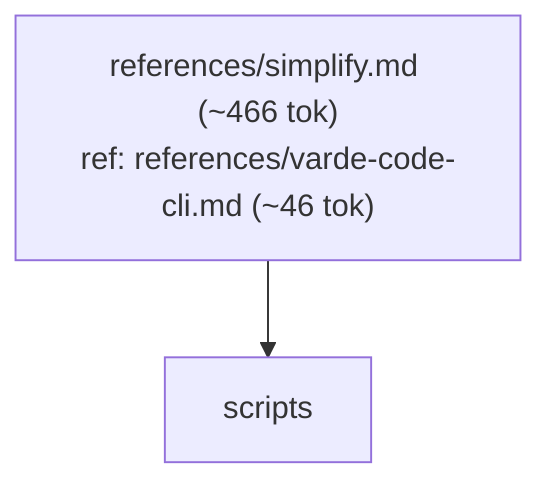

# varde-review flow

Generated for human readers; agents do not load this file. Regenerate
with skill-flow.py --write from varde-agent-doc-authoring. Dotted edges
are conditional loads; min tokens follow only solid edges. Thick edges
are hand-offs to a later stage, outside min and max. Double-bordered
nodes are skill modes run inline or agent dispatches. Min and max count
this skill; main adds modes the main agent runs inline, each file once.
Subagents are per dispatch (multiply by the dispatch count); * marks a
conditional dispatch. Module overview first, then one diagram per module.

## Files

- SKILL.md (~594 tok; routes: Review a diff, branch, or code area and write down what i..., Apply the findings an earlier review already wrote down, Address review threads or failing checks on an open GitHu..., Inspect a running web, iOS simulator, or macOS app visual..., Tidy up what was just changed — naming, redundancy, consi..., Run a varde-code scan and decide what its findings mean, Fix one named, already recorded standalone finding)
  - references/fix.md (~1193 tok; routes: Apply the findings an earlier review already wrote down, Address review threads or failing checks on an open GitHu..., Fix one named, already recorded standalone finding)
    - references/fix-pass.md (~1060 tok; routes: Apply the findings an earlier review already wrote down, Address review threads or failing checks on an open GitHu..., Fix one named, already recorded standalone finding)
    - references/fix-pr.md (~431 tok; routes: Address review threads or failing checks on an open GitHu...)
  - references/report.md (~1115 tok; routes: Review a diff, branch, or code area and write down what i...)
    - references/report-categories.md (~1060 tok; routes: Review a diff, branch, or code area and write down what i...)
    - references/report-format.md (~916 tok; routes: Review a diff, branch, or code area and write down what i..., Apply the findings an earlier review already wrote down, Address review threads or failing checks on an open GitHu..., Inspect a running web, iOS simulator, or macOS app visual..., Run a varde-code scan and decide what its findings mean, Fix one named, already recorded standalone finding)
  - references/review-gate-plan.md (~457 tok; routes: Review a diff, branch, or code area and write down what i..., Apply the findings an earlier review already wrote down, Address review threads or failing checks on an open GitHu..., Inspect a running web, iOS simulator, or macOS app visual..., Tidy up what was just changed — naming, redundancy, consi..., Run a varde-code scan and decide what its findings mean, Fix one named, already recorded standalone finding)
  - references/review-gate-record.md (~570 tok; routes: Review a diff, branch, or code area and write down what i...)
  - references/review-gate-worktree.md (~469 tok; routes: Review a diff, branch, or code area and write down what i..., Apply the findings an earlier review already wrote down, Address review threads or failing checks on an open GitHu..., Inspect a running web, iOS simulator, or macOS app visual..., Tidy up what was just changed — naming, redundancy, consi..., Run a varde-code scan and decide what its findings mean, Fix one named, already recorded standalone finding)
  - references/review-gates.md (~1279 tok; routes: Review a diff, branch, or code area and write down what i..., Apply the findings an earlier review already wrote down, Address review threads or failing checks on an open GitHu..., Inspect a running web, iOS simulator, or macOS app visual..., Tidy up what was just changed — naming, redundancy, consi..., Run a varde-code scan and decide what its findings mean, Fix one named, already recorded standalone finding)
  - references/scan.md (~947 tok; routes: Run a varde-code scan and decide what its findings mean)
  - references/simplify.md (~466 tok; routes: Tidy up what was just changed — naming, redundancy, consi...)
  - references/varde-code-cli.md (~46 tok; routes: Review a diff, branch, or code area and write down what i..., Tidy up what was just changed — naming, redundancy, consi...)
  - references/visual.md (~947 tok; routes: Inspect a running web, iOS simulator, or macOS app visual...)

### fix

### report

### review

### scan

### scripts

### simplify

### visual

## Routes

| Route | Min tokens | Max tokens | Main min | Main max | Subagents per dispatch | Lookups | Files |
|---|---|---|---|---|---|---|---|
| Review a diff, branch, or code area and write down what i... | ~3731 | ~6506 | ~3731 | ~6506 | review* ~3308, review* ~4596-7371 | 0 | references/report.md, references/review-gates.md, references/report-categories.md, references/report-format.md, references/varde-code-cli.md, references/review-gate-record.md, references/review-gate-plan.md, references/review-gate-worktree.md, scripts/risk-tier.py |
| Apply the findings an earlier review already wrote down | ~3763 | ~5968 | ~3763 | ~5968 | executor* ~3539, executor ~3925-7890, review* ~3308, review* ~4596-7371 | 0 | references/fix.md, references/review-gates.md, references/report-format.md, references/fix-pass.md, references/review-gate-plan.md, references/review-gate-worktree.md, scripts/risk-tier.py, scripts/snapshot.sh |
| Address review threads or failing checks on an open GitHu... | ~4194 | ~6399 | ~4194 | ~6399 | executor* ~3539, executor ~3925-7890, review* ~3308, review* ~4596-7371 | 0 | references/fix.md, references/fix-pr.md, references/review-gates.md, references/report-format.md, references/fix-pass.md, scripts/pr-intake.py, references/review-gate-plan.md, references/review-gate-worktree.md, scripts/risk-tier.py, scripts/snapshot.sh |
| Inspect a running web, iOS simulator, or macOS app visual... | ~2457 | ~4662 | ~2457 | ~4662 | review* ~3308, review* ~4596-7371 | 0 | references/visual.md, references/review-gates.md, references/report-format.md, references/review-gate-plan.md, references/review-gate-worktree.md, scripts/risk-tier.py |
| Tidy up what was just changed — naming, redundancy, consi... | ~1106 | ~3311 | ~1106 | ~3311 | review* ~3308, review* ~4596-7371 | 0 | references/simplify.md, references/review-gates.md, references/varde-code-cli.md, scripts/snapshot.sh, references/review-gate-plan.md, references/review-gate-worktree.md, scripts/risk-tier.py |
| Run a varde-code scan and decide what its findings mean | ~2457 | ~4662 | ~2457 | ~4662 | review* ~3308, review* ~4596-7371 | 0 | references/scan.md, references/review-gates.md, references/report-format.md, references/review-gate-plan.md, references/review-gate-worktree.md, scripts/risk-tier.py |
| Fix one named, already recorded standalone finding | ~3763 | ~5968 | ~5002 | ~9919 | review* ~3308, review* ~4596-7371, executor* ~3539, executor ~3925-7890 | 0 | references/fix.md, references/review-gates.md, references/report-format.md, references/fix-pass.md, references/review-gate-plan.md, references/review-gate-worktree.md, scripts/risk-tier.py, scripts/snapshot.sh |

## Structure

| Measure | Value | Target | Status |
|---|---|---|---|
| Mutual links | 0 | 0 | ok |
| Max links out of one file | 4 (references/report.md) | < 6 | ok |
| Average links per linking file | 1.78 (16 links, 9 files) | <= 2 | ok |
| Cross-module edges | 11 | - | - |
| Diagram edges | 42 | <= 60 | ok |
| Max route cyclomatic | 8 | <= 10 | ok |
| Max route cognitive | 15 | <= 10 warn, <= 15 error | warning |
| Most files reached by one route | 10 (Address review threads or failing checks on an open GitHu...) | <= 15 | ok |

## Findings

- chain: references/fix-pass.md <- references/fix.md
- chain: references/report-categories.md <- references/report.md
- single caller: references/fix-pr.md <- SKILL.md: Address review threads or failing checks on an open GitHu...
- single caller: references/report.md <- SKILL.md: Review a diff, branch, or code area and write down what i...
- single caller: references/scan.md <- SKILL.md: Run a varde-code scan and decide what its findings mean
- single caller: references/simplify.md <- SKILL.md: Tidy up what was just changed — naming, redundancy, consi...
- single caller: references/visual.md <- SKILL.md: Inspect a running web, iOS simulator, or macOS app visual...
- shared: references/fix.md <- SKILL.md: Address review threads or failing checks on an open GitHu...; SKILL.md: Apply the findings an earlier review already wrote down; SKILL.md: One recorded finding
- shared: references/report-format.md <- references/fix.md; references/report.md; references/scan.md; references/visual.md
